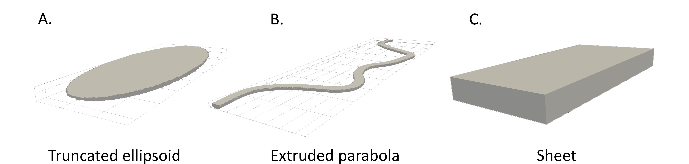
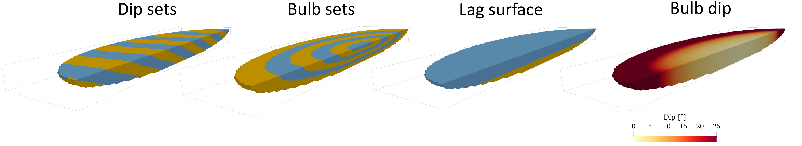
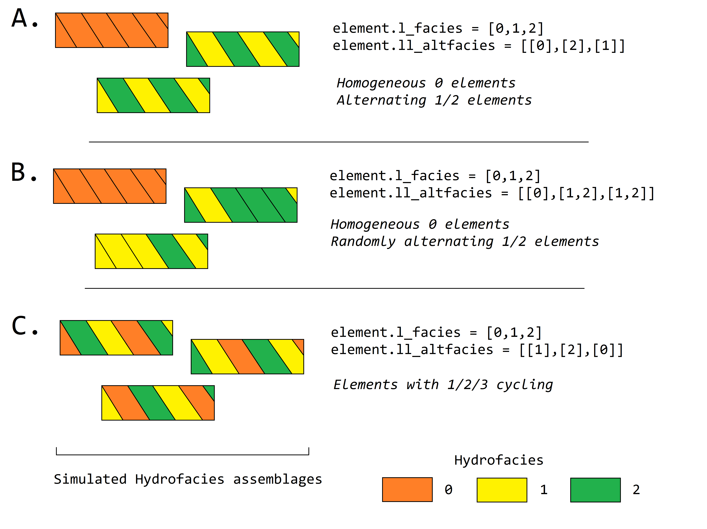

==========================================================
HyVR Computational methods
==========================================================

The first step in the HyVR algorithm is to load the model parameters, as defined
in the ``*.ini`` initialisation file. These model parameters govern how the
model will look like. A detailed documentation of all the options can be found
:ref:`here <inout>`. Major strata contact surfaces are generated first.
Architectural elements are then generated inside each stratum according to given
probabilities. Finally, geometrical objects/hydrofacies assemblages like
troughs, sheets, or channels are generated inside the architectural element.

After the model has been generated output values like facies, azimuth and dip
are assigned to all grid points depending on which stratum/architectural
element/object they belong to.

Based on these values (facies, azimuth, dip) and the settings in the
``[hydraulics]`` section, the hydralic parameters (porosity, isotropic hydraulic
conductivity, full hydraulic conductivity tensor) are assigned, and potentially
heterogeneity in these parameters on the given level.

.. _hfm:
.. figure:: 	img/hfm.png
	:align: 	center
	:width:		80%
	
	*Hierarchical modeling framework implemented in HyVR.*

*Note that in this section model input parameters are denoted in the following manner:* ``parameter-section.parameter``.

----------------------------------------------------------------------
Simulation of strata and architectural element contact surfaces
----------------------------------------------------------------------

Strata are defined in the input parameter file by their bottom surface contact
models and the architectural elements that are to be included within them. The
top contact surface is then generated and all model cells between the upper
and lower contact surface (which is the top of the next stratum) are assigned
to the stratum.

Contact surfaces can either be flat or random. Multi-Gaussian random contact
surfaces are generated using the spectral methods outlined by
:cite:`Dietrich1993`. These methods require structural statistical parameters
(i.e. mean and variance) for the quantity of interest, and a geostatistical
covariance model. We used a Gaussian covariance model in the present study to
produce smoothly varying surfaces:

.. math::
  R_{ss}(h)=\sigma^2_s \exp\left[ - \left[ \frac{\Delta x}{\lambda}\right]^2 \right]

where :math:`s` is the random quantity of interest, :math:`\sigma^2_s` is the
variance of :math:`s` (here elevation), :math:`\Delta x` is the distance between
the two points, and :math:`\lambda` is the correlation length.

Once a bottom and top surface for a stratum is generated, architectural elements
are created inside the stratum.

The architectural elements will be simulated based on input parameters defined
for each stratum. This starts with the random choice of an architectural element
from those defined; the probability of each architectural element being chosen
is also defined in the input parameter file. The thickness of the architectural
element is then drawn from a random normal distribution that is defined for each
stratum in the input parameter file. To account for the erosive nature of many
sedimentary environments the algorithm may erode the underlying units: here the
'avulsion' thickness :math:`th_{avulsion}` is subtracted from the bottom and top
of the architectural element :math:`z^{bot}_{AE}, z^{top}_{AE}`. Once the
architectural element has been defined, contact surfaces are generated using the
same procedure as used for strata contact surfaces. When the architectural
element have been generated, the algorithm begins to simulate external
hydrofacies assemblage geometries and hydrofacies.

----------------------------------------------------------------------
Simulation of hydrofacies assemblages and hydrofacies geometries
----------------------------------------------------------------------

The generation of hydrofacies assemblages and internal hydrofacies occurs
stratum- and architectural-element-wise, beginning with the top-most
architectural element in the top stratum. The simulation of individual
hydrofacies assemblages is object-based, with random placement of features
within the architectural element. Object-based methods have been implemented
widely in subsurface simulation :cite:`Jussel1994,Bennett2017` as they are
generally computationally efficient and relatively easy to parameterize. The
HyVR program approximates hydrofacies assemblages with simple geometric shapes.
Currently, three shapes_ are supported: troughs (truncated ellipsoids), channels (extruded
parabolas), and sheets. Truncated ellipsoids and extruded parabolas are
'erosive' hydrofacies assemblages: this means that within the HyVR algorithm
they are able to erode underlying units, and therefore the architectural element
(and strata) boundaries may be altered during the course of the simulation.

.. _shapes:

	
	*Geometries implemented in HyVR.*

Four properties are assigned to each model grid cell during this simulation
step: *ae*, *ha_arr*, *hat_arr*, *facies*, *azimuth*, and *dip*. The *ae*
property denotes which architectural element (from ``strata.ae``) has been
assigned to a model grid cell. The *ha_arr* property is the unique identifier
for each individual hydrofacies assemblage generated. *hat_arr* denotes the type
of hydrofacies assemblage within the model grid cell is located. The *facies*
property denotes which hydrofacies has been assigned to a model grid cell. The
*azimuth* :math:`\kappa` and *dip* :math:`\psi` properties are associated with
the bedding structure at each model grid cell and denote the angle of the
bedding plane from the mean direction of flow and horizontal, respectively.

.. _temethod:

^^^^^^^^^^^^^^^^^^^^^^
Truncated ellipsoids
^^^^^^^^^^^^^^^^^^^^^^

Truncated ellipsoids are generated as a proxy for trough-like features. The
method for generating the boundaries of these features has been described
previously in :cite:`Bennett2017`. Generation starts at :math:`z^{bot}_{AE unit}
+AE_{depth}\cdot\beta` where :math:`AE_{depth}` is the depth of the truncated
ellipsoid geometry, and :math:`\beta` is a buffer term that allows the user to
control how much of the underlying unit is eroded. The centre of the truncated
ellipsoid (:math:`x,y` coordinates) and the paleoflow angle :math:`\alpha` (i.e.
major ellipsoid axis orientation) are drawn from a random uniform distribution
and the boundary of the truncated ellipsoid is simulated. The `internal
structure`_ of truncated ellipsoids can be defined in the following ways:
	
* trough-wise homogeneous, with constant azimuth and dip; 
* bulb-dip, with azimuth and dip values based on the three-dimensional gradient
  at the ellipsoid boundary ('bulb dip');
* bulb-sets, comprising nested alternating hydrofacies with :math:`\kappa` and
  :math:`\psi` values generated as for bulb-type;
* dip-sets internal structure, where the features have a constant :math:`\kappa`
  and :math:`\psi` but the assigned hydrofacies alternate throughout the
  truncated ellipsoid.
	
.. _structure:

	
	*Internal structure of truncated ellipsoid hydrofacies assemblages.*
	
Once a truncated ellipsoid has been generated, an aggradation thickness
(``trunc_ellip.agg``) is added to the current simulation elevation
:math:`z_{sim}` and the next assemblage is simulated. This occurs until
:math:`z_{sim} = z^{top}_{AE}`.

.. only:: html
	
  :ref:`Truncated ellipsoid parameters <teparams>`

""""""""""""""""""""""""
Bulb dip
""""""""""""""""""""""""
Bulb hydrofacies assemblages is simulated by calculating the tangential vector
at the boundary of the truncated ellipsoid and then the angle between the
tangential vector and a horizontal plane. This angle is then compared with a
'maximum dip angle' (``dip``) and the smaller of these two values is assigned to
all model grid cells within the hydrofacies assemblage with equivalent
:math:`x,y`-coordinates (i.e. column-wise).
The tangential vector is calculated as gradient of

.. math::
  d^2(x,y,z) = \left(\frac{x}{a}\right)^2 + \left(\frac{y}{b}\right)^2  + \left(\frac{z}{c}\right)^2 

""""""""""""""""""""""""
Bulb sets
""""""""""""""""""""""""

Nested-bulb-like layers are simulated by subdividing the depth of the truncated
ellipsoid into a series with a set thickness ``trunc_ellip.bulbset_d``.
Truncated ellipsoids are simulated consecutively with the same center point and
paleoflow :math:`\alpha` value, starting with the deepest assemblage. With each
simulation, a scaling factor is calculated by dividing the new depth with the
total depth of the assemblage. This scaling factor is applied to the length and
width parameters of the truncated ellipsoid. Each newly generated ellipsoid
subsumes the previous. Each nested assemblage represents a constant hydrofacies,
however the orientation of these hydrofacies may differ within the entire
hydrofacies assemblage, to create bulb-like features that have been reported in
the field. The dip of the nested ellipsoids defaults to that determined by the
three-dimension gradient at the nested-ellipsoid boundary.

""""""""""""""""""""""""
Dip sets
""""""""""""""""""""""""
Refer to :ref:`dipset section <Dipset>`.

^^^^^^^^^^^^^^^^^^^^^^
Extruded parabolas
^^^^^^^^^^^^^^^^^^^^^^

Parabolas extruded along arbitrary curves with variable sinuosity are useful to
represent channels. Extruded parabola centrelines in HyVR are parameterized
using the disturbed periodic model implemented by :cite:`Ferguson1976`:

.. math::
  \theta + \frac{2h}{k} \frac{d\theta}{ds} + \frac{1}{k^2} \frac{d^2\theta}{ds^2}  = \epsilon(s)

with curve direction :math:`\theta`, damping factor :math:`h \in [0,1]`,
:math:`k = 2\pi/\lambda` is the wavenumber with :math:`\lambda` the frequency of
the undamped sine wave, and :math:`s` is the distance along the curve. This
model can be approximated using the following second-order autoregressive model
described in Equation 15 of :cite:`Ferguson1976`:

.. math::
  \theta_i - b_1 \theta_{i-1} - b_2\theta{i-2} = \epsilon_i

with:

.. math::
  b_1 = 2 e^{-kh}\cos(k\arcsin(h))

.. math::
  b_2 = -e^{-2kh}

This method was also used by :cite:`Pyrcz2009` for the simulation of alluvial
depositional features. Model grid cells are assigned to the extruded parabola if
the following conditions are met:

.. math::
  D^2 \leqslant \frac{w^2_{ch}}{4} - \left[ \frac{(z_{ch} - z_{cell})\cdot\Delta z \cdot w_{ch}}{d_{ch}} \right] ^2 \; \wedge \; z_{cell} \leqslant z_{ch}

where :math:`D^2` is the two-dimensional (:math:`x,y`) distance from the cell to
the extruded parabola centerline, :math:`w_{ch}` and :math:`d_{ch}` are the
extruded parabola width and depth respectively, :math:`z_{ch}` and
:math:`z_{cell}` are the elevations of the extruded parabola top and node
respectively, and :math:`\Delta z` is the model grid cell :math:`z` dimension.
Two-dimensional 'channel velocities' :math:`\vec{v}` are evaluated at the
centerline and then interpolated to grid cells using an
inverse-distance-weighted interpolation. Azimuth values are calculated by taking
the arctangent of the two-dimensional channel velocity at a given point. Dip
values of grid cells within the extruded parabola are assigned based on input
parameters. If alternating hydrofacies are to be simulated they are constructed
by creating planes that are evenly spaced along the extruded parabola
centerline.

The HyVR algorithm generates extruded parabolas starting from :math:`z^{bot}_{AE
unit} +AE_{depth}\cdot\beta`, as for truncated ellipsoids. However, to account
for the multiple extruded parabolas that are often concurrently present in many
river systems, multiple extruded parabolas can be generated at each simulation
depth (``ext_par.channel_no``). The starting :math:`x,y` coordinates for the
centerlines are drawn from a random uniform distribution such that
:math:`x\in[-50,0]` and :math:`y\in[0,Y]`. Extruded parabola geometries are then
assigned sequentially to the model grid cells; note that in HyVR there is no
interaction of extruded parabolas, and subsequent extruded parabolas will
supersede (or 'erode') those previously generated. Once the predefined number of
extruded parabolas stipulated by ``ext_par.channel_no`` has been simulated a
three-dimensional migration vector ``ext_par.mig`` is added to the extruded
parabola centerlines and the extruded parabola assignment to model grid cells
begins again. The reuse of the extruded parabola centerline trajectories is more
efficient than re-simulating these values at each :math:`z_{sim}`. This
continues until :math:`z_{sim} = z^{top}_{seq}`.

.. only:: html
	
  :ref:`Extruded parabola parameters <chparams>`

^^^^^^^^^^^^^^^^^^^^^^
Sheets
^^^^^^^^^^^^^^^^^^^^^^
Sheets are comparatively simple to generate as they are laterally continuous
across the entire model domain (depending on strata boundaries). The internal
structure of sheet features may be massive (i.e. without internal structure), or
laminations can be generated. In the HyVR algorithm laminations are simulated
sequentially by assigning all model grid cells between a specific elevation
interval the appropriate hydrofacies codes. Dipping set structures can also be
incorporated into these features. Sheets may differ in internal orientation, as
specified in the input parameters.

.. only:: html
	
  :ref:`Sheet parameters <shparams>`

^^^^^^^^^^^^^^^^^^^^^^
Internal structure
^^^^^^^^^^^^^^^^^^^^^^
The internal structure of the hydrofacies assemblages is distinguished by
hydrofacies. The internal structure of an hydrofacies assemblage may be
homogeneous, dipping or ellipsoidal (for truncated ellipsoid only).
Additionally, lag surfaces composed of different hydrofacies may be simulated in
erosive (i.e. extruded parabola, truncated ellipsoid) hydrofacies assemblage.

.. _Dipset:

""""""""""""""""""""""""
Dipset 
""""""""""""""""""""""""
Architectural elements may be populated with dipping hydrofacies structures.
Such structures are generated by creating planes at regular intervals throughout
the architectural element, as defined by ``element.dipset_d``. In truncated
ellipsoids the planes are constructed along the centerline of the element,
perpendicular to the paleoflow angle :math:`\alpha`. In extruded parabola
elements, the planes are constructed along the centerline and are perpendicular
to :math:`\vec{v}(x)`. The distance from the centre of each model grid cell to
all planes is calculated and then the model grid cells between planes are
assigned a hydrofacies value.

""""""""""""""""""""""""
Lag surfaces 
""""""""""""""""""""""""
Lag surfaces can be set for erosive hydrofacies assemblages by setting the
``element.lag`` parameter. This parameter consists of two values:

* The thickness of the lag surface from the element base; and
* The hydrofacies identifier to be assigned.
	
Lag surfaces cannot have any internal dipping structure.

""""""""""""""""""""""""
Alternating hydrofacies
""""""""""""""""""""""""
Sedimentary deposits can often exhibit cyclicity in their features; therefore,
HyVR allows alternating hydrofacies to be simulated. This is controlled by
sequentially assigning hydrofacies within each hydrofacies assemblage, starting
with a hydrofacies randomly selected from those to be simulated in the
architectural element (``element.facies``). The hydrofacies which is assigned
next is drawn from a subset of hydrofacies specified in the
``element.altfacies`` input parameter. For each hydrofacies in
``element.facies``, a list of alternating hydrofacies (i.e., which hydrofacies
can follow the present one) is stipulated. By only specifying one hydrofacies ID
in the ``element.altfacies``, it guarantees that that ID will be selected. The
figure below gives three examples of different input parameters.

.. _altfac:

	
	*Variations on alternating hydrofacies in architectural elements*

^^^^^^^^^^^^^^^^^^^^^^
Linear trends
^^^^^^^^^^^^^^^^^^^^^^

The HyVR algorithm allows for linear trends in geometry sizes with increasing
elevation by setting the ``element.geo_ztrend`` parameter. This parameter
comprises a bottom and top factor :math:`\xi_{bottom},\xi_{top}` that multiply
the usual geometry dimensions. For intermediate elevations the :math:`z` factor
is calculated through a linear interpolation of :math:`\xi_{bottom},\xi_{top}`.
The parameters of each geometry may be set for each individual architectural
element included in the model parameter file.

-----------------------------------
Simulation of hydraulic parameters
-----------------------------------

Hydraulic parameters are simulated once all features have been generated. The
distributed hydraulic parameter outputs of HyVR are: the isotropic hydraulic
conductivity :math:`K_{iso}(x,y,z)`; porosity :math:`\theta(x,y,z)`; and the
full hydraulic conductivity tensor :math:`\textbf{K}(x,y,z)`, defined for each
model grid cell.

Microstructure of hydraulic parameters is first simulated for each individual
hydrofacies assemblage (as present in the ``mat`` storage array) simulated in
the previous steps. Spatially varying :math:`\ln(K_{iso})` and :math:`\theta`
fields are generated for each hydrofacies present in an hydrofacies assemblage
using spectral methods to simulate random multi-Gaussian fields with an
exponential covariance model:

.. math::
  R_{ss}(h)=\sigma^2_s \exp\left[ - \left| \frac{\Delta x}{\lambda}\right| \right]

An anisotropic ratio is also assigned to each model grid cell according to the
hydrofacies present; these ratios are globally constant for each hydrofacies.

Microstructure may also be assigned to model grid cells that are not within
hydrofacies assemblage. This background heterogeneity is simulated for each
architectural element using values defined for each architectural element type
(``element.bg``). Simulation methods are the same as for within-assemblage
heterogeneity.

Spatial trends may also be applied once isotropic hydraulic-conductivity values
have been assigned to all model grid cells. As for trends in hydrofacies
assemblage geometry, trends are assigned using a linearly-interpolated factor
:math:`\xi_{start},\xi_{end}` in the :math:`x`- and/or :math:`z`-directions. The
value of each model grid cell is then multiplied by the trend factors.

.. _tensorgen:

^^^^^^^^^^^^^^^^^^^^^^^^^^^^^^
Hydraulic-conductivity tensors
^^^^^^^^^^^^^^^^^^^^^^^^^^^^^^

Full hydraulic-conductivity tensors for each model grid cell are calculated by
multiplying the isotropic hydraulic conductivity :math:`K^{iso}`, with a rotated
anisotropy matrix :math:`\textbf{M}`:

.. math::
   \textbf{K}_i =K^{iso}_i\textbf{R}_i\textbf{M}_i\textbf{R}_i^T

.. math::
   \textbf{R}_i = \begin{bmatrix} \cos(\kappa_i)\cos(\psi_i) & \sin(\kappa_i) & \cos(\kappa_i)\sin(\psi_i)\\ -\sin(\kappa_i)\cos(\psi_i) & \cos(\kappa_i) & -\sin(\kappa_i)\sin(\psi_i)\\ -\sin(\psi_i) & 0 & \cos(\psi_i) \end{bmatrix}

Parameters :math:`\psi_i` and :math:`\kappa_i` are the simulated bedding
structures (dip and azimuth, respectively). The anisotropy matrix
:math:`\textbf{M}_i` is diagonal with lateral terms set as equivalent (i.e.
:math:`K_{xx} = K_{yy}`). This approach is identical to that of
:cite:`Bennett2017`. Once this has been completed, the simulated parameter files
are saved and can be used for groundwater flow and solute transport simulations.

